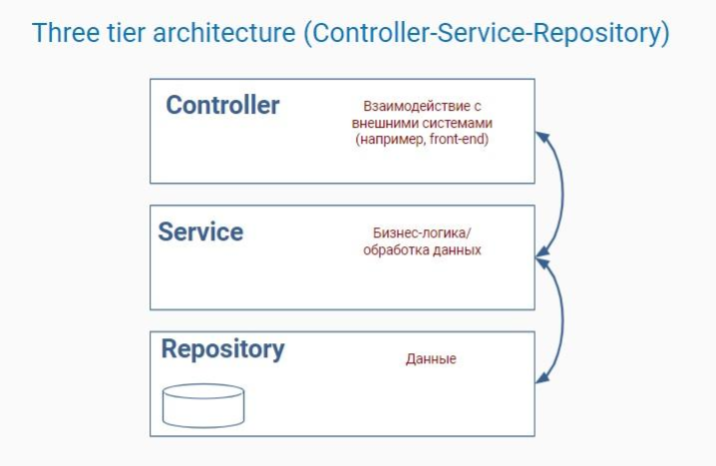

**Задачи на урок:**

    Многослойная архитектура
    Проект по реализации консольного приложения с трехслойной архитектурой

**архитектура приложения** 

(`Controller-Service-Repository`)


**Классическая архитектура приложения** 

`Controller-Service-Repository` 

включает следующие слои:

    Слой "контроллеров" (Controller) - отвечают за конечное взаимодействие с клиентом (в нашем случае т.е. WEB приложение этот слой отвечает за обработку HTTP)
    Слой "сервисов" (Service) - отвечает за бизнес-логику приложения
    Слой "репозиториев" (Repository) - отвечает за взаимодействие с хранилищем данных



The Controller-Service-Repository pattern is prevalent in a lot of applications especially Spring Boot applications. One of the big reasons is that it does a great job of a separation of concerns: The Controller layer, at the top of this picture, is solely responsible for exposing the functionality so that it can be consumed by external entities (including, perhaps, a UI component). The Repository layer, at the bottom of this picture, is responsible for storing and retrieving some set of data. The Service layer is where all the business logic should go. If the business logic requires fetching/saving data, it wires in a Repository. If someone wants to access this business logic, they go through a Controller to get there. If code is related to storage/retrieval, it should go in the Repository. If its dealing with exposing functionality, it goes in the Controller. Anything unique in the business logic would go in the Service layer. The Repository doesn’t care which component is invoking it; it blindly does what it is asked. The Service layer doesn’t care how it gets accessed, it just does its work, using a Repository where required. And the Controller is just passing the work down to the Service layer, so it can stay nice and lean. It’s a pretty simple separation of concerns.

We create an additional, separate layer model or entity (models of the business area, entities that will be saved in the repository) ё

Шаблон `Controller-Service-Repository` часто используется в приложениях, в том числе Spring Boot. Одна из главных причин, заключается в том, что он отлично справляется с разделением задач: уровень контроллера несет полную ответственность за предоставление функциональности, чтобы ее могли использовать внешние объекты ( включая, возможно, компонент пользовательского интерфейса). Уровень репозитория отвечает за хранение и извлечение некоторого набора данных. Уровень сервиса — это место, где должна находиться вся бизнес-логика. Если бизнес-логика требует выборки/сохранения данных, она подключается к репозиторию. Если кто-то хочет получить доступ к этой бизнес-логике, он проходит через контроллер. Если код связан с хранением/извлечением, он должен находиться в репозитории. Если речь идет о предоставление функциональности, это происходит в контроллере. Все уникальное в бизнес-логике будет помещено на уровень сервиса.

Репозиторию не важно, какой компонент его вызывает; он слепо делает то, что его просят. Уровень сервиса не заботится о том, как к нему осуществляется доступ, он просто выполняет свою работу, используя репозиторий, где это необходимо. Контроллер просто передает запросы на уровень сервиса. Это довольно простое разделение задач.

Кроме того, создаем лополнительный, отдельный слой `model` или `entity` (_модели предметной области_, _сущности_, которые будем сохранять в хранилище)

**Важно**:

    Для обеспечения гибкости приложений следует применять подход, при котором один класс не зависит от другого напрямую. Вместо этого мы создаем интерфейсы и прописываем зависимости через них.
    Для обеспечения гибкости приложений все взаимодействия в приложение осцествляются между соседними слоями т.е. котнроллер не может вызывать репозиторий напрямую. Репозиторий не обращается у контроллеру. Вместо этого еонтроллер вызывает методы сервис-слоя, а сервис слой вызывает методы репозитория.

```java
code/consultation49/src/Box.java

public class Box {

    int value;

    public Box(int value) {
        this.value = value;
    }

    public int getValue() {
        return value;
    }

    public void setValue(int value) {
        this.value = value;
    }

    @Override
    public String toString() {
        return "Box{" +
                "value=" + value +
                '}';
    }
}
```

```java
code/consultation49/src/Employee.java

public class Employee {
private String name;
private int salary;

    public Employee(String name, int salary) {
        this.name = name;
        this.salary = salary;
    }

    public String getName() {
        return name;
    }

    public int getSalary() {
        return salary;
    }

    @Override
    public String toString() {
        return "Employee{" +
                "name='" + name + '\'' +
                ", salary=" + salary +
                '}';
    }
}
```

```java
code/consultation49/src/Main.java

import java.util.function.BiConsumer;
import java.util.function.BinaryOperator;
import java.util.function.Supplier;
import java.util.stream.Collector;
import java.util.stream.Stream;

public class Main {

    /*
    Есть класс Employee  с полями String name и int salary. Написать свой коллектор,
    считающий суммарную зарплату всех сотрудников.
     */
    public static void main(String[] args) {

        Employee employee1 = new Employee("John",2500);
        Employee employee2 = new Employee("Peter",3500);
        Employee employee3 = new Employee("Mary",4000);
        Employee employee4 = new Employee("Ann",1000);

        Supplier<Box> supplier = () -> {
            System.out.println("Supplying starting value");
            return new Box(0);
        };

        BiConsumer<Box,Employee> accumulator = (result,employee) -> {
           result.setValue(result.getValue() + employee.getSalary());
            System.out.println(result.getValue() +" "+ employee.getName());
        };

        BinaryOperator<Box> combiner = (res1,res2)-> {
           res1.setValue (res1.getValue() + res2.getValue());

           return res1;
        };

        Collector<Employee,Box,Box> collector = Collector.of(
                supplier,
                accumulator,
                combiner
        );


      Box box =  Stream.of(employee1,employee2,employee3,employee4)
                .parallel()
                .collect(collector);

        System.out.println("Total salary is " + box);

    }
}
```

```java
code/consultation49/src/OurLinkedList.java

package our_linkedlist;

public class OurLinkedList <E> implements OurList<E>{

    private int size;
    private Node<E>first;
    private Node<E>last;

    public OurLinkedList(){

    }

    public void append(E value){
        if(size > 0){
            Node<E>newNode = new Node<>(null,last,value);
            last.next = newNode;
            last = newNode;
        } else{
            Node<E> newNode = new Node<>(null,null,value);
            first = newNode;
            last = newNode;
        }
        size++;
    }

    public E get( int index){
        if( index >= size || index < 0)
            throw new IndexOutOfBoundsException();

        Node<E> needle = getNode(index);

        return needle.value;
    }

    private Node<E> getNode(int index){
        Node<E> needle = first;

        for( int i = 0; i < index; i++){
            needle = needle.next;
        }
        return needle;
    }

    public void set( E o, int index){
        if( index >= size || index < 0)
            throw  new IndexOutOfBoundsException();

        Node needle = getNode(index);
        needle.value = o;
    }

    public int size(){
        return size;
    }

    public boolean contains(E o){
        Node needle = first;

        for( int i = 0; i < size; i++){
            if(needle.value.equals(o))
                return true;

            needle = needle.next;
        }
        return false;
    }

    public boolean remove(E o){
        Node needle = first;

        for( int i = 0; i < size; i++){
            if(needle.value.equals(o)){
                removeById(i);
                return true;
            }
            needle = needle.next;
        }
        return false;
    }

    public E removeById( int index){
        if( index >= size || index < 0)
            throw  new IndexOutOfBoundsException();

        Node<E> nodeToRemove = getNode(index);
        Node<E>left = nodeToRemove.prev;
        Node<E>right = nodeToRemove.next;

        if( index > 0 && index < size - 1){

            nodeToRemove.next = null;
            nodeToRemove.prev = null;

            left.next = right;
            right.prev = left;

        }else if ( index == 0){
            right.prev = null;
            first = right;
        } else {
            left.next = null;
            last = left;
        }
        size--;
        return nodeToRemove.value;
    }


    private static class Node<E>{

        Node<E> prev;
        Node<E> next;
        E value;

        Node(Node<E>next, Node<E>prev, E value){
            this.next = next;
            this.prev = prev;
            this.value = value;
        }
    }
}
```

```java
code/consultation49/src/OurList.java

package our_linkedlist;

import com.sun.source.tree.UsesTree;

public interface OurList <E> extends Iterable<E>{

    void append(E o);
    E get(int index);

    void set(E o, int index);

    int size();
    boolean contains(E o);

    boolean remove(E o);

    E removeById(int index);
}
```

```java
code/controllers/src/UserController.java

import ait.model.User;

import java.util.List;

public interface UserController {

    public void create();

    User getById();
    User getByEmail();

    public List<User> getAll();
    public void printAll();

    public void delete();

    public void update();
}
```

```java
code/controllers/src/UserControllerConsoleImpl.java

import ait.model.User;
import ait.services.UserService;

import java.util.List;
import java.util.Scanner;

public class UserControllerConsoleImpl implements UserController{
Scanner scanner = new Scanner(System.in);
private UserService service;

    public UserControllerConsoleImpl(UserService service){
        this.service = service;
    }

    public void create(){
        System.out.println("Enter name:");
        String name = scanner.nextLine();

        System.out.println("Enter email: ");
        String email = scanner.nextLine();

        try {
            service.createUser(name, email);
        } catch (Exception e){
            System.out.println(e.getMessage());
        }
    }

    public User getById(){
        System.out.print("Enter id:");
        String id = scanner.nextLine();

       return service.getById(Long.parseLong(id));
    }

    public User getByEmail(){
        System.out.println("Enter email: ");
        String email = scanner.nextLine();

        return service.getByEmail(email);
    }

    public List<User> getAll(){
       return service.getAllUsers();
    }

    public void printAll(){
        List<User>allUsers = service.getAllUsers();
        if(allUsers.isEmpty()){
            System.out.println("There are still no users or the data is not available");
        } else {
            allUsers.forEach(System.out :: println);
        }
    }

    public void delete(){
        System.out.println("Enter id: ");
        String id = scanner.nextLine();
        service.deleteById(Long.parseLong(id));
    }

    public void update(){
        System.out.println("Enter id of the user you want to update: ");
        String id = scanner.nextLine();

        System.out.println("Enter new name: ");
        String name = scanner.nextLine();

        System.out.println("Enter new email: ");
        String email = scanner.nextLine();

        User tempUser = new User(Long.parseLong(id),name,email);

        try {
            service.updateUser(tempUser);
        } catch (Exception e){
            System.out.println(e.getMessage());
        }
    }
}
```

```java
code/model/src/User.java

import java.util.Objects;

public class User {

    private Long id;
    private String name;
    private String email;

    public User( String name, String email){
        this.name = name;
        this.email = email;
    }

    public User( Long id, String name, String email){
        this.id = id;
        this.name = name;
        this.email = email;
    }

    @Override
    public boolean equals(Object o) {
        if (this == o) return true;
        if (o == null || getClass() != o.getClass()) return false;

        User user = (User) o;

        if (!Objects.equals(id,user.id)) return false;
        if (!Objects.equals(name, user.name)) return false;
        return Objects.equals(email, user.email);
    }

    @Override
    public int hashCode() {
        int result = id != null ? id.hashCode() : 0;
        result = 31 * result + (name != null ? name.hashCode() : 0);
        result = 31 * result + (email != null ? email.hashCode() : 0);
        return result;
    }

    public Long getId() {
        return id;
    }

    public void setId(Long id) {
        this.id = id;
    }

    public String getName() {
        return name;
    }

    public void setName(String name) {
        this.name = name;
    }

    public String getEmail() {
        return email;
    }

    public void setEmail(String email) {
        this.email = email;
    }

    public String toString(){
        return id + " " + " " +name + " " + email;
    }
}
```


```java
code/repositories/src/CrudRepository.java

import java.util.List;

public interface CrudRepository<T> {

    void save( T item);
    T findById( Long id);
    List<T> findAll();
    void deleteById(Long id);
    void update(T item);
}
```

```java
code/repositories/src/UserRepository.java

import ait.model.User;

public interface UserRepository extends CrudRepository<User>{
public User findByEmail( String email);
}
```

```java
code/services/src/UserService.java

import ait.model.User;

import java.util.List;

public interface UserService {

    public void createUser( String name, String email);
    public User getById( long id);
    public User getByEmail(String email);

    public List<User> getAllUsers();

    public void updateUser(User user);
    public void deleteById( long id);
}
```
